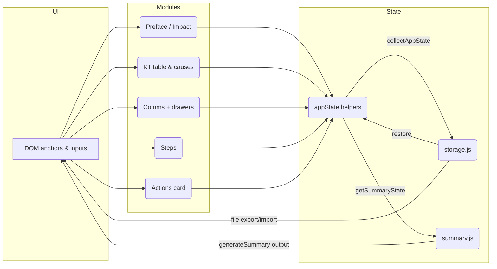

# Architecture Overview

This document explains how the intake app boots, which modules own which DOM regions, and how data flows among the UI, the in-memory `appState`, persistent storage, and the summary generator. Use it as a map when extending existing modules or wiring new ones into `main.js`.

## Boot sequence orchestrated by `main.js`

`main.js` is the entry point referenced by `index.html`. Once `DOMContentLoaded` fires it runs `boot()`, which performs the following steps:

1. **Expose shared utilities** – assigns `window.showToast` first so modules and tests can emit notifications even before the rest of the UI finishes initializing.
2. **Configure the KT table module** – calls `configureKT()` with callbacks owned by other modules:
   - `autoResize` keeps textarea heights in sync with content.
   - `onSave` points to `saveAppState()` so KT edits trigger persistence.
   - `onTokensChange` points to `updatePrefaceTitles()` so `{OBJECT}` / `{DEVIATION}` tokens stay current.
   - `getObjectFull` / `getDeviationFull` let KT helper text reuse Preface values.
   - `showToast` lets KT surface inline alerts without directly importing the toast module.
3. **Bring the KT experience online** – `initTable()`, `ensurePossibleCausesUI()`, and `renderCauses()` hydrate the IS/IS NOT grid and cause cards inside `[section:table]`.
4. **Initialize feature modules with save hooks** –
   - `initPreface({ onSave: saveAppState })` wires `[section:preface]` / `[section:impact]` inputs.
   - `initializeCommunications({ onSave: saveAppState, showToast })` prepares the communications drawer DOM.
   - `initCommsDrawer()` and `initTemplatesDrawer()` set up the slide-in panels triggered from the header anchors.
   - `initStepsFeature({ onSave: saveAppState, onLog: logCommunication })` mounts the checklist UI and lets checkbox toggles emit communications log entries.
5. **Connect summary generation** – registers `getSummaryState` as the summary module’s state provider via `setSummaryStateProvider()`.
6. **Restore persisted state** – `restoreSavedIntake()` pulls any `kt-intake-full-v2` snapshot via `restoreFromStorage()` and rehydrates modules through `applyAppState()`.
7. **Backfill Preface defaults** – `setBridgeOpenedNow()` runs if the bridge start timestamp is missing, then `updatePrefaceTitles()` and `startMirrorSync()` keep mirrored headings in sync.
8. **Attach DOM event listeners** – dedicated `wire*` helpers connect buttons and drawers to their modules:
   - Summary buttons (`#genSummaryBtn`, `#generateAiSummaryBtn`) call `generateSummary()`.
   - Comms, templates, and “Start Fresh” controls toggle their drawers or invoke `startFresh()`.
   - File Save/Load buttons call `exportAppStateToFile()` and `importAppStateFromFile()`.
   - `wireKeyboardShortcuts()` installs Alt-key shortcuts for summary and communications logging.
9. **Finalize utilities** – `initVersionStamp()` stamps the footer, `mountAfterPossibleCauses()` inserts the Actions List card, and `exposeGlobals()` retains legacy `window.onGenerateSummary` helpers for bookmarked scripts.

## Module responsibilities & shared callbacks

| Module | Primary responsibilities | Shared callbacks/inputs |
| --- | --- | --- |
| `main.js` | Orchestrates boot, registers DOM listeners, wires file transfer + global shortcuts, exposes fallbacks for legacy integrations. | Relies on every feature module’s public API, but only coordinates them—it never reaches into DOM anchors it does not own. |
| `src/preface.js` | Manages `[section:preface]` + `[section:impact]` inputs, detection chips, mirror sync, and tokens such as `{OBJECT}` and `{DEVIATION}`. | Supplies `autoResize`, `updatePrefaceTitles`, `startMirrorSync`, `setBridgeOpenedNow`, `getPrefaceState`, `getObjectFull`, `getDeviationFull`. Receives `onSave` from `main.js`. |
| `src/kt.js` | Owns `[section:table]`: builds the IS/IS NOT table, possible-cause cards, focus modes, and cause evidence previews. | Accepts callbacks from Preface & Toast via `configureKT()`. Provides `exportKTTableState`, `importKTTableState`, `getPossibleCauses`, and other helpers consumed by `appState` & summary modules. |
| `src/comms.js` & `src/commsDrawer.js` | Handle the communications drawer DOM (`#commsDrawer` + backdrop), cadence inputs, log visibility, and logging buttons. | `initializeCommunications()` receives `onSave` + `showToast`. `initStepsFeature({ onLog: logCommunication })` lets checklist actions add log entries. `main.js` uses `getCommunicationElements()` to wire buttons. |
| `src/templatesDrawer.js` & `src/templateExport.js` | Manage the templates drawer UI, prompt users for metadata, and export the current state as a reusable template JSON. | `handleTemplateExportClick()` invokes `exportCurrentStateAsTemplate()` with metadata from Preface and uses `showToast` for feedback. |
| `src/steps.js` | Controls the checklist drawer anchored near the table, maintains completion metrics, and exposes import/export helpers. | Accepts `{ onSave, onLog }` callbacks; exposes `exportStepsState`, `importStepsState`, `getStepsItems`, and `getStepsCounts` for `appState` + summary. |
| `components/actions/ActionListCard.js` & `src/actionsStore.js` | Render the Actions card mounted after `#possibleCausesCard`, persist action items under `kt-actions-by-analysis-v1`, and notify listeners via `refreshActionList()`. | `appState` imports/exports actions alongside the main intake snapshot and dispatches `intake:actions-updated` events when rehydrated. |
| `src/appState.js` | Central collector/rehydrator that aggregates feature state, converts it into a serialized snapshot, and reapplies it later. | Supplies `collectAppState`, `applyAppState`, `getSummaryState`, `resetAnalysisId`. Imports helpers from Preface, KT, communications, steps, and actions modules to do so. |
| `src/storage.js` | Owns the `kt-intake-full-v2` serialization contract, handles migrations, and exposes `saveToStorage`, `restoreFromStorage`, `clearAllIntakeStorage`, plus cause serialization helpers. | Called exclusively via `main.js` (saving/restoring) and `appState`. |
| `src/summary.js` | Formats Preface, KT, steps, comms, and actions state into readable summaries or AI prompts. | Depends on `setSummaryStateProvider(getSummaryState)` so it never touches DOM directly; `generateSummary()` is invoked by buttons and keyboard shortcuts. |
| `src/fileTransfer.js` | Bridges `collectAppState()` / `applyAppState()` with Blob/FileReader APIs to power Save/Load buttons in the header. | Used solely by `main.js` so user actions can export/import snapshots outside of `localStorage`. |
| `src/toast.js`, `src/versionStamp.js` | Provide shared UI niceties (toasts, footer stamp). | `showToast` is passed to modules that need user feedback; `initVersionStamp` is called once from `boot()`. |

### Callback graph highlights

- **Persistence hooks** – Preface, communications, KT, steps, and drawer modules all receive `onSave: saveAppState`, letting them trigger serialization after significant edits. `saveAppState()` simply calls `collectAppState()` and forwards the snapshot to `saveToStorage()`.
- **Communications + steps loop** – `initStepsFeature()` receives `onLog: logCommunication`. Checking certain steps emits an internal/external log entry, keeping ops leaders in sync without duplicating logging logic.
- **Preface token sharing** – KT configuration pulls Preface getters so cause cards, tooltips, and summary builders can render the same `{OBJECT}` / `{DEVIATION}` strings without re-querying the DOM.
- **Summary coupling** – `main.js` calls `setSummaryStateProvider(getSummaryState)` exactly once; from then on the summary module resolves everything lazily (bridge names, containment status, cause evidence, steps counts, comms log, and action items) when any summary button fires.

## Persistence and summary data flow

1. **State capture** – `saveAppState()` → `collectAppState()` → `saveToStorage()` writes JSON to `localStorage` (`kt-intake-full-v2`) and mirrors the latest actions under `kt-actions-by-analysis-v1`.
2. **File export/import** – Save/Load buttons call `exportAppStateToFile()` / `importAppStateFromFile()`, which use the same serialized payload so cross-browser transfers reuse the storage contract.
3. **Restore on boot** – `restoreSavedIntake()` reads from storage and passes the payload to `applyAppState()`. That function pushes each slice of data back into its owner module (Preface, KT, comms, steps, actions) before re-rendering possible causes and refreshing the Actions card.
4. **Summary generation** – When `generateSummary()` runs it asks the registered provider (`getSummaryState`) for a read-only bundle of DOM nodes, helper callbacks (e.g., `buildHypothesisSentence`, `getStepsCounts`), and user-entered data. Summary builders never mutate the DOM—they format strings for `[section:summary]`, clipboard copies, or AI prompts.

### Flow diagram

## DOM anchors → module owners

- `<!-- [section:preface] -->` and `<!-- [section:impact] -->`: owned by `src/preface.js`. Handles hero fields, detection/evidence chips, mirror titles, and bridge metadata.
- `<!-- [section:table] -->`: owned by `src/kt.js`. Contains the IS/IS NOT table, possible-causes card stack, and the Actions card that `mountAfterPossibleCauses()` inserts after `#possibleCausesCard`.
- `<!-- [section:summary] -->`: populated by `src/summary.js` via `generateSummary()` output.
- `#commsDrawer` + `#templatesDrawer` (and their toggles `#commsBtn`, `#templatesBtn`): owned by `src/commsDrawer.js` and `src/templatesDrawer.js` respectively, while `src/comms.js` manages log controls within the drawer content.
- Header buttons (`#saveToFileBtn`, `#loadFromFileBtn`, `#startFreshBtn`, `#bridgeSetNowBtn`, summary triggers) are wired in `main.js` but delegate to modules listed above.

Keeping modules scoped to their anchors avoids cross-feature DOM mutations and makes `appState` the single source of truth for persistence and summaries.
